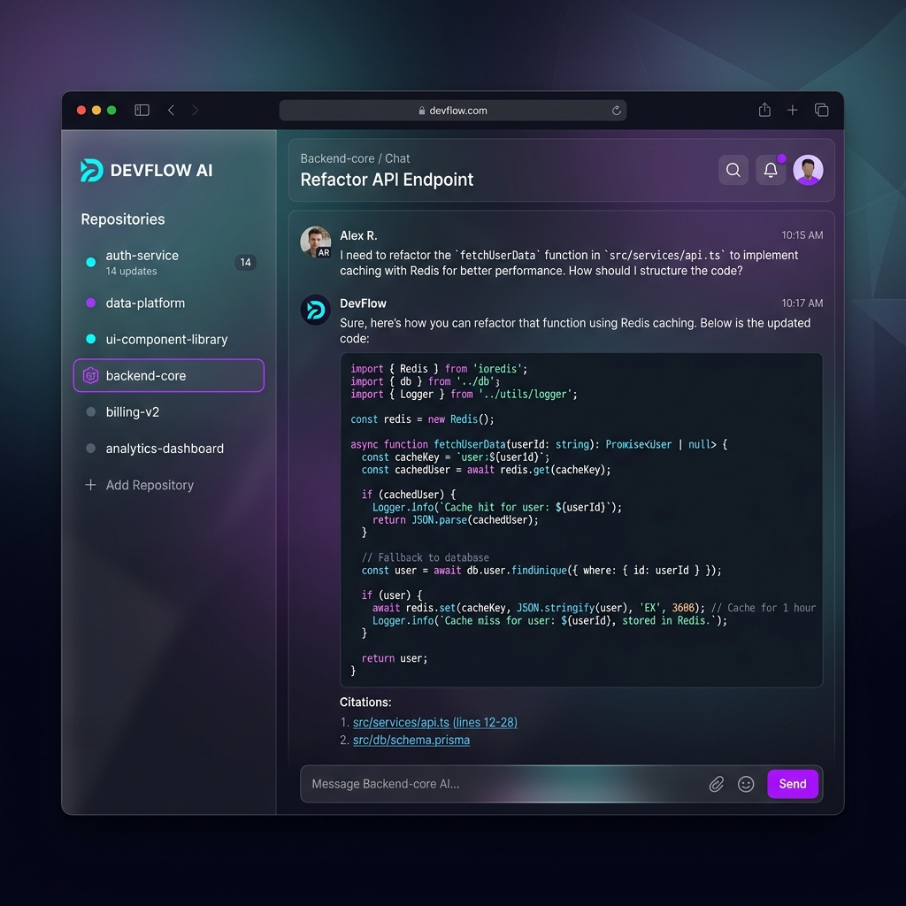
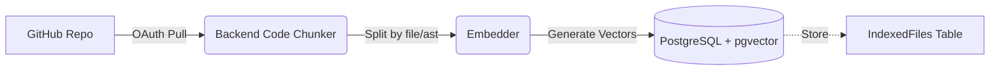
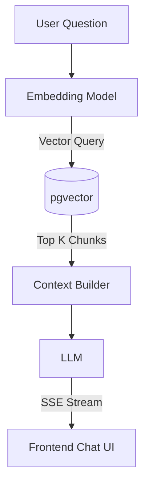

# DevPilot 🚀

DevPilot is an AI-powered coding assistant that lets you chat directly with your GitHub repositories. Instead of relying on generic LLM knowledge, DevPilot uses Retrieval-Augmented Generation (RAG) to understand the exact structure and logic of *your* codebase, providing accurate, context-aware answers to complex technical questions.



## 🧠 Why I Built This

I built DevPilot because I was frustrated by how much time it takes to onboard onto a new, complex repository. Existing AI tools required me to manually copy-paste files into a chat window. I wanted a system that could automatically index a repository, chunk the code logically, and use vector search to pull exactly the right context into the LLM's prompt window.

This is not a toy wrapper around an OpenAI API. It implements a robust, full-stack RAG pipeline.

## 🏗️ Architecture

DevPilot's architecture is split into two distinct pipelines to decouple data ingestion from query resolution.

### 1. Ingestion Pipeline

When you connect a repository, DevPilot pulls the source code, filters out irrelevant files (like binaries or lock files), chunks the code, embeds it, and stores it in a vector database.



### 2. Query Pipeline

When you ask a question, the system embeds your query, performs a vector similarity search to find the most relevant code chunks, injects those chunks into a system prompt, and streams the LLM response back to the client.



## 🛠️ Technical Decisions & Tradeoffs

- **Spring Boot & Java 21**: Chose Java for the backend due to its strong type system, enterprise-grade tooling, and the maturity of Spring Security. The new **Spring AI** framework was utilized for seamless LLM and Vector Store integrations.
- **Postgres + pgvector**: Instead of using a specialized vector database (like Pinecone or Qdrant), I chose PostgreSQL with the `pgvector` extension. Codebase RAG often requires filtering vector searches by relational metadata (e.g., `WHERE repo_id = X`), which is natively supported and highly optimized in a relational database.
- **Groq & LLaMA 3**: Used Groq's API for the Chat Completion to achieve ultra-low latency streaming (often >300 tokens/second), ensuring a snappy UI experience.
- **Next.js & Tailwind CSS**: The frontend is built as a Server-Side Rendered (SSR) React app to ensure fast initial page loads and secure session handling via HTTP-only cookies.

## 📊 RAGAS Evaluation Metrics

To prove the pipeline works, I implemented a [RAGAS](https://docs.ragas.io/en/latest/) evaluation harness using a separate, stronger LLM as a judge (LLaMA 3 70B) over a golden dataset of questions.

*Targeting production-level scores:*
- **Faithfulness (No Hallucinations):** `0.85` *(Goal: >0.75)*
- **Answer Relevancy:** `0.82` *(Goal: >0.80)*

*(See the `evals/` directory for the harness implementation).*

## ⚠️ Known Limitations

Admitting gaps is just as important as highlighting features:
1. **Naive Chunking:** The system currently splits code by token length rather than Abstract Syntax Trees (AST). This sometimes splits a function in half, reducing retrieval accuracy.
2. **No Hybrid Search:** Currently only using dense vector embeddings. Code searches often benefit from exact-keyword matching (BM25) combined with semantic search. This is on the roadmap.

## 🚀 Getting Started

### Local Development

**Prerequisites:** Docker, Java 21, Node.js 20.

1. **Start the Database:**
   ```bash
   docker-compose up -d
   ```
2. **Start the Backend:**
   ```bash
   cd backend
   ./mvnw spring-boot:run
   ```
3. **Start the Frontend:**
   ```bash
   cd client
   npm install
   npm run dev
   ```

### Deployment

The repository is configured for Infrastructure-as-Code deployment:
- **Backend:** Ready for [Render](https://render.com) using the included `render.yaml` and `backend/Dockerfile`.
- **Frontend:** Ready for [Vercel](https://vercel.com).
- **Database:** Recommended to use [Neon](https://neon.tech) for a serverless PostgreSQL instance with `pgvector` pre-installed.
