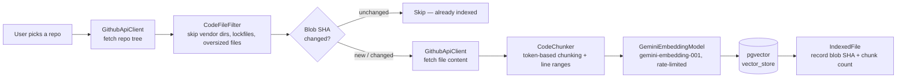
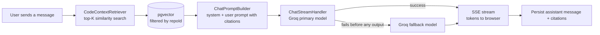

# DevPilot

**Chat with any GitHub repository.** DevPilot indexes a repo's source into a vector store and lets you ask it questions in plain English — answers come back grounded in the actual code, with file/line citations, not generic guesses.

<!-- TODO: add a screenshot or short GIF of the chat UI here before sharing this README publicly -->

## The problem this solves

Getting oriented in an unfamiliar codebase is slow — cloning a repo, grepping around, and reading files one at a time to answer a question as simple as "where does auth happen" or "what does this function actually do." DevPilot skips that: point it at a repo you have access to, let it index, and ask questions directly. It retrieves the relevant chunks of actual source and has an LLM answer from them, so responses are traceable back to real files and line ranges instead of being plausible-sounding guesses.

## Features

- **GitHub OAuth** — connect your account, browse your repos (owned, collaborator, and org repos).
- **Incremental indexing** — repos are chunked and embedded into Postgres/pgvector. Re-indexing diffs against each file's GitHub blob SHA, so unchanged files are skipped entirely instead of re-embedding the whole repo every time.
- **Streaming RAG chat** — questions are answered over a live SSE stream, grounded in vector-retrieved code context, with citations back to specific files and line ranges.
- **Resilient LLM usage** — if the primary chat model fails before producing output, DevPilot automatically retries with a fallback model. Both embedding and chat calls are proactively rate-limited (a token-bucket limiter paces requests under each provider's RPM/TPM budget) instead of just reacting to 429s after the fact.
- **Consistent error handling** — a custom exception hierarchy and global handler mean upstream provider failures (GitHub, Gemini, Groq) surface as clean, safe messages in the UI, never raw provider errors or stack traces.

## Tech stack

| Layer | Technology |
|---|---|
| Backend | Spring Boot 4.1.1, Spring AI 2.0.1, Java 21 |
| Auth | Spring Security + GitHub OAuth2 |
| Database | PostgreSQL 16 + pgvector (via Flyway migrations) |
| Embeddings | Gemini (`gemini-embedding-001`, via its OpenAI-compatible endpoint) |
| Chat | Groq (OpenAI-compatible chat completions, streamed) |
| Frontend | Next.js 16, React 19, TanStack Query v5, Tailwind CSS v4 |

## Architecture

### Ingestion pipeline — indexing a repo



### Query pipeline — answering a chat message



## Technical decisions

- **Postgres + pgvector, not a dedicated vector database.** One database for both relational data (users, repos, chat history) and vectors keeps operations simple for a project this size — no second service to run, back up, or reason about.
- **Gemini embeddings, truncated to 768 dimensions.** Gemini's OpenAI-compatible endpoint only serves `gemini-embedding-001`; its native output (3072-dim) is truncated via the model's Matryoshka `dimensions` parameter. Smaller vectors mean a smaller, faster HNSW index, at some cost to embedding fidelity — a reasonable tradeoff for a code-retrieval use case where exact semantic precision matters less than for, say, legal search.
- **Groq for chat, with a model-fallback chain.** Groq's inference speed is a good fit for a streaming chat UX, but free-tier throughput per model is tightly capped. Rather than a single model with no recourse, the app tries a configured list of models in order, falling back only if the failing model produced zero output — so a fallback never splices two different models' output into one answer.
- **Proactive rate limiting, not just reactive retries.** A shared token-bucket limiter paces outbound Gemini and Groq calls under their account's RPM/TPM budget *before* firing a request, rather than only reacting to a 429 after it happens.
- **Blob-SHA diffing for re-indexing, not full re-embed.** GitHub's tree API returns a content-addressed SHA per file; comparing that against what was last indexed means an unchanged file costs nothing to re-index — no fetch, no chunking, no embedding call.

## Known limitations

This is an actively evolving project. Current gaps, in rough priority order:

- **Secrets currently ship as hardcoded fallback defaults** in `application.properties` — these must be rotated to real environment variables with no committed fallback before any public deployment.
- **No automated test coverage yet** beyond a context-load smoke test.
- **Rate limiters are in-process state** (a `ConcurrentHashMap`/instance fields, no shared store) — correct for a single instance, but would need to move to something like Redis before horizontally scaling.
- **No way yet to delete a repo, or rename/delete a chat session** — data accumulates with no cleanup path from the UI.

The full audit trail of bugs found and fixed lives in [`ISSUES.md`](ISSUES.md); a prioritized roadmap of what's next — deployment, evals, hybrid search, and more — lives in [`IMPROVEMENTS.md`](IMPROVEMENTS.md).

## Getting started

### Prerequisites

- Java 21
- Node.js 20+
- Docker (for local Postgres/pgvector)
- A GitHub OAuth App, a Groq API key, and a Gemini API key

### 1. Start Postgres

```bash
docker compose up -d
```

This starts Postgres 16 with the pgvector extension on `localhost:5434` (db `devpilot`, user/pass `postgres`/`postgres`).

### 2. Run the backend

```bash
cd backend
GROQ_API_KEY=your_key \
GEMINI_API_KEY=your_key \
GITHUB_CLIENT_ID=your_id \
GITHUB_CLIENT_SECRET=your_secret \
TOKEN_ENCRYPTOR_PASSWORD=your_password \
TOKEN_ENCRYPTOR_SALT=your_salt \
./mvnw spring-boot:run
```

Boots on `http://localhost:8080`, applying Flyway migrations automatically.

### 3. Run the frontend

```bash
cd client
npm install
npm run dev
```

Runs on `http://localhost:3000`.

### Environment variables

| Variable | Where | Purpose |
|---|---|---|
| `GROQ_API_KEY` | backend | Groq chat completions |
| `GEMINI_API_KEY` | backend | Gemini embeddings |
| `GITHUB_CLIENT_ID` / `GITHUB_CLIENT_SECRET` | backend | GitHub OAuth App credentials |
| `TOKEN_ENCRYPTOR_PASSWORD` / `TOKEN_ENCRYPTOR_SALT` | backend | Encrypts stored GitHub access tokens at rest |
| `DB_URL` / `DB_USERNAME` / `DB_PASSWORD` | backend | Defaults match `docker-compose.yml` |
| `FRONTEND_URL` / `CORS_ALLOWED_ORIGINS` | backend | Defaults to `http://localhost:3000` |
| `NEXT_PUBLIC_API_BASE_URL` | frontend | Defaults to `http://localhost:8080` |

See `backend/src/main/resources/application.properties` for the full list and defaults.
